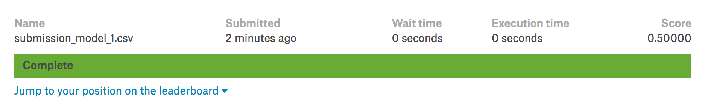
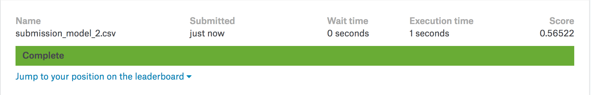
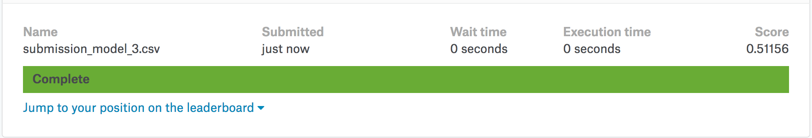

just a test on
```{r setup, include=FALSE}
# Load all your packages here:
library(tidyverse)
library(yardstick)

# Set default behavior for all code chunks here:
knitr::opts_chunk$set(
  echo = TRUE, warning = FALSE, message = FALSE,
  fig.width = 16/2, fig.height = 9/2
)

# Set seed value of random number generator here. This is in order to get
# "replicable" randomness, so that any results based on random sampling or
# resampling are replicable everytime you knit this file. Why use a seed value
# of 76? For no other reason than 76 is one of my favorite numbers:
# https://www.youtube.com/watch?v=xjJ7FheCkCU
set.seed(76)
```

You will be submiting an entry to Kaggle's [DonorsChoose.org Application Screening: Predict whether teachers' project proposals are accepted](https://www.kaggle.com/c/donorschoose-application-screening/){target="_blank"} by fitting a **logistic regression** model $\hat{f}(x)$.


***


# EDA

Read in data provided by Kaggle for this competition. They are organized in the `data/` folder of this RStudio project:

```{r}
training <- read_csv("data/train.csv")
test <- read_csv("data/test.csv")
sample_submission <- read_csv("data/sample_submission.csv")
```

Before performing any model fitting, you should always conduct an exploratory data analysis. This will help guide and inform your model fitting. 

## Look at your data!

Always, ALWAYS, **ALWAYS** start by looking at your raw data. This gives you visual sense of what information you have to help build your predictive models. To get a full description of each variable, read the data dictionary in the `data_description.txt` file in the `data/` folder.

Note that the following code chunk has `eval = FALSE` meaning "don't evaluate this chunk with knitting" because `.Rmd` files won't knit if they include a `View()`:

```{r, eval = FALSE}
View(training)
glimpse(training)

View(test)
glimpse(test)
```

In particular, pay close attention to the variables and variable types in the
`sample_submission.csv`. Your submission must match this exactly.

```{r}
glimpse(sample_submission)
```

```{r}
hist(training$project_is_approved)
```

```{r}
ggplot(data = training, aes(x=teacher_number_of_previously_posted_projects, y=project_is_approved)) +
  geom_jitter(height=0.01)
```


## Data wrangling

As much as possible, try to do all your data wrangling here:

```{r}
training$project_grade_category <- as.factor(training$project_grade_category)
training$project_grade_category <- relevel(training$project_grade_category, "Grades PreK-2")
test$project_grade_category <- as.factor(test$project_grade_category)
test$project_grade_category <- relevel(test$project_grade_category, "Grades PreK-2")
```


***


# Minimally viable product

## Fit model on training

Fit a logistic regression model $\widehat{f}_1$ with only an intercept term on all the training data. In other words, your model will not use any predictor variables. Save this in `model_1`. What is the uniquely fitted probability?

```{r}
model_1 <- glm(project_is_approved~1, data= training, family = binomial())
```


What is the uniquely fitted probability?

All other factors being equal, the log odds of being approved is 1.90702, therefore probability of getting approved is approx 84%


## Estimate of your Kaggle score

Use the `yardstick` package to get an estimate of your Kaggle score: the area under the ROC curve (AUC). Crossvalidation is not necessary as with no predictor variables, we are in very little danger of overfitting the model. 

```{r}
fitted_points_model_1 <- model_1 %>%
  broom::augment()
```


```{r}
fitted_points_model_1 <- fitted_points_model_1 %>%
  mutate(
    fitted_prob = 1/(1 + exp(-.fitted)),
    fitted_prob_inverse = 1/(1 + exp(.fitted))

    )

roc_auc(fitted_points_model_1, as.factor(project_is_approved), fitted_prob_inverse)
```

## Make predictions on test

Apply your `model_1` fitted model to the test data. What is the uniquely predicted probability?

```{r}
predict_model_1 <- model_1 %>%
  broom::augment(newdata = test)
```


## Create your submission CSV

```{r}
submission <- test %>% 
  mutate(
    project_is_approved = exp(predict_model_1$.fitted)/(1+exp(predict_model_1$.fitted))
    ) %>%
  select(id, project_is_approved)


write_csv(submission, path = "data/submission_model_1.csv")
```


## Screenshot of your Kaggle score

Our score based on our submission's "Area under the Receiver Operating Characteristic Curve" was 0.5.

{ width=100% }


***


# Due diligence

## Plot ROC curve

Use the `yardstick` package to plot the ROC curve:

```{r}
autoplot(roc_curve(fitted_points_model_1, as.factor(project_is_approved), fitted_prob_inverse ))
```


***


# Reaching for the stars

## Fit model on training

Fit a logistic regression model $\widehat{f}_2$ using a single numerical predictor variable $x$ on all the training data. Save this in `model_2`. Then display a single visualization that shows:

* The relationship between outcome variable $y$ and your numerical predictor variable $x$ with black points
* The relationship between the fitted probabilities $\widehat{p}$ from model $\widehat{f}_2$ and your numerical predictor variable $x$ with a red curve
* The fitted probabilities $\widehat{p}$ from model $\widehat{f}_1$ with a horizontal blue line at the same time.


```{r}
model_2 <- glm(project_is_approved ~ teacher_number_of_previously_posted_projects, data= training, family = binomial())


fitted_points_model_2 <- model_2 %>%
  broom::augment()

fitted_points_model_2 <- fitted_points_model_2 %>%
    mutate(
    fitted_prob = 1/(1 + exp(-.fitted)),
    fitted_prob_inverse = 1/(1 + exp(.fitted))
    )


fitted_points_model_1$teacher_number_of_previously_posted_projects <- training$teacher_number_of_previously_posted_projects

ggplot(data = fitted_points_model_2, aes(x=teacher_number_of_previously_posted_projects, y=project_is_approved)) +
  geom_jitter(height=0.01) +
  geom_line(data = fitted_points_model_1, mapping = aes(y = fitted_prob), col = "blue", size = 1) + #plot model_1 probabilities
  geom_line(data = fitted_points_model_2, mapping = aes(y = fitted_prob), col = "red", size = 1) + #plot model_2 probabilities
  labs(x = "number of perviously posted projects", y = "project is approved")


```


## Estimate of your Kaggle score

Use the `yardstick` package to get an estimate of your Kaggle score: the area under the ROC curve (AUC). Crossvalidation is not necessary as with only 1 predictor variable and so many points, we are in very little danger of overfitting the model. 

```{r}
roc_auc(fitted_points_model_2, as.factor(project_is_approved), fitted_prob_inverse)
```


## Make predictions on test

Apply your `model_2` fitted model to the test data and display a histogram of the predicted probabilities.

```{r}
predict_model_2 <- model_2 %>%
  broom::augment(newdata = test)

predict_model_2 <- predict_model_2 %>%
  mutate(
    fitted_prob = exp(predict_model_2$.fitted)/(1+exp(predict_model_2$.fitted))
    )


ggplot(data=predict_model_2, aes(predict_model_2$fitted_prob)) +
  geom_histogram() +
  labs(x = "fitted probability", title = "model_2 on test data")
```


## Create your submission CSV

```{r}
submission2 <- test %>% 
  mutate(project_is_approved = predict_model_2$fitted_prob) %>%
  select(id, project_is_approved)


write_csv(submission2, path = "data/submission_model_2.csv")
```


## Screenshot of your Kaggle score

Our score based on our submission's "Area under the Receiver Operating Characteristic Curve" was 0.5.

{ width=100% }


## Plot ROC curve

Use the `yardstick` package to plot the ROC curve:

```{r}
autoplot(roc_curve(fitted_points_model_2, as.factor(project_is_approved), fitted_prob_inverse ))
```


***


# Point of diminishing returns

## Fit model on training

Fit a logistic regression model $\widehat{f}_3$ using a single categorical predictor variable $x$ on all the training data. Save this in `model_3`. Then display a single visualization that shows:

* The relationship between the fitted probabilities $\widehat{p}$ from model $\widehat{f}_3$ and your categorical predictor variable $x$
* The fitted probabilities $\widehat{p}$ from model $\widehat{f}_1$ with a horizontal blue line at the same time.

```{r}

model_3 <- glm(project_is_approved ~ project_grade_category, data= training, family = binomial())


fitted_points_model_3 <- model_3 %>%
  broom::augment()

fitted_points_model_3 <- fitted_points_model_3 %>%
    mutate(
    fitted_prob = 1/(1 + exp(-.fitted)),
    fitted_prob_inverse = 1/(1 + exp(.fitted))
    )


fitted_points_model_1$project_grade_category <- training$project_grade_category


  
  # for some reason this doesn't work the same as above

ggplot(data = fitted_points_model_3, aes(x=project_grade_category, y=fitted_prob)) +
  geom_boxplot() + 
  geom_line(
    data = fitted_points_model_1, mapping = aes(y = fitted_prob, x =  project_grade_category, group=1 ),
    col = "blue", size = 1) + 
    labs(x = "grade level", y = "probability project approved") 

  

```


## Estimate of your Kaggle score

Use the `yardstick` package to get an estimate of your Kaggle score: the area under the ROC curve (AUC). Crossvalidation is not necessary as with only 1 predictor variable and so many points, we are in very little danger of overfitting the model. 

```{r}
roc_auc(fitted_points_model_3, as.factor(project_is_approved), fitted_prob_inverse)
```


## Make predictions on test

Apply your `model_3` fitted model to the test data and display a histogram of the predicted probabilities.

```{r}
predict_model_3 <- model_3 %>%
  broom::augment(newdata = test)

predict_model_3 <- predict_model_3 %>%
  mutate(
    fitted_prob = exp(predict_model_3$.fitted)/(1+exp(predict_model_3$.fitted))
    )

#does hisotogram need to show grade levels?
ggplot(data=predict_model_3, aes(fitted_prob)) +
  geom_histogram() +
  labs(x = "fitted probability", title = "model_3 on test data")
```


## Create your submission CSV

```{r}
submission3 <- test %>% 
  mutate(project_is_approved = predict_model_3$fitted_prob) %>%
  select(id, project_is_approved)


write_csv(submission3, path = "data/submission_model_3.csv")
```


## Screenshot of your Kaggle score

Our score based on our submission's "Area under the Receiver Operating Characteristic Curve" was 0.5.

{ width=100% }


## Plot ROC curve

Use the `yardstick` package to plot the ROC curve:

```{r}
autoplot(roc_curve(fitted_points_model_3, as.factor(project_is_approved), fitted_prob_inverse ))
```


# Polishing the Cannonball
```{r}
model_4 <- glm(project_is_approved ~ project_grade_category + teacher_number_of_previously_posted_projects, data= training, family = binomial())

fitted_points_model_4 <- model_4 %>%
  broom::augment()

fitted_points_model_4 <- fitted_points_model_4 %>%
    mutate(
      fitted_prob = exp(fitted_points_model_4$.fitted)/(1+exp(fitted_points_model_4$.fitted)),
      fitted_prob2 = 1/(1 + exp(.fitted))
    )

autoplot(roc_curve(fitted_points_model_4, as.factor(project_is_approved), fitted_prob ))
roc_auc(fitted_points_model_4, as.factor(project_is_approved), fitted_prob2)


predict_model_4 <- model_4 %>%
  broom::augment(newdata = test) 
  
predict_model_4 <- predict_model_4 %>%
  mutate(
    fitted_prob = exp(predict_model_4$.fitted)/(1+exp(predict_model_4$.fitted))
    )


submission4 <- test %>% 
  mutate(project_is_approved = predict_model_4$fitted_prob) %>%
  select(id, project_is_approved)

write_csv(submission4, path = "data/submission_model_4.csv")


```


