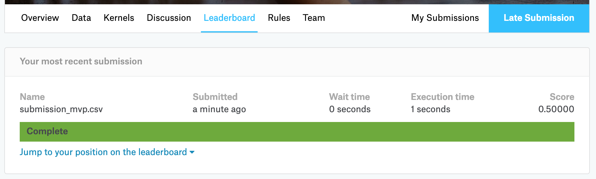

```{r setup, include=FALSE}
# Load all your packages here:
library(tidyverse)
library(yardstick)

# Set default behavior for all code chunks here:
knitr::opts_chunk$set(
  echo = TRUE, warning = FALSE, message = FALSE,
  fig.width = 16/2, fig.height = 9/2
)

# Set seed value of random number generator here. This is in order to get
# "replicable" randomness, so that any results based on random sampling or
# resampling are replicable everytime you knit this file. Why use a seed value
# of 76? For no other reason than 76 is one of my favorite numbers:
# https://www.youtube.com/watch?v=xjJ7FheCkCU
set.seed(76)
```

You will be submiting an entry to Kaggle's [DonorsChoose.org Application Screening: Predict whether teachers' project proposals are accepted](https://www.kaggle.com/c/donorschoose-application-screening/){target="_blank"} by fitting a **logistic regression** model $\hat{f}(x)$.


***


# EDA

Read in data provided by Kaggle for this competition. They are organized in the `data/` folder of this RStudio project:

```{r}
training <- read_csv("data/train.csv")
test <- read_csv("data/test.csv")
sample_submission <- read_csv("data/sample_submission.csv")
```

Before performing any model fitting, you should always conduct an exploratory data analysis. This will help guide and inform your model fitting. 

## Look at your data!

Always, ALWAYS, **ALWAYS** start by looking at your raw data. This gives you visual sense of what information you have to help build your predictive models. To get a full description of each variable, read the data dictionary in the `data_description.txt` file in the `data/` folder.

Note that the following code chunk has `eval = FALSE` meaning "don't evaluate this chunk with knitting" because `.Rmd` files won't knit if they include a `View()`:

```{r, eval = FALSE}
View(training)
glimpse(training)

View(test)
glimpse(test)
```

In particular, pay close attention to the variables and variable types in the
`sample_submission.csv`. Your submission must match this exactly.

```{r}
glimpse(sample_submission)
```

## Data wrangling

As much as possible, try to do all your data wrangling here:

```{r}

```


***


# Minimally viable product

## Fit model on training

Fit a logistic regression model $\widehat{f}_1$ with only an intercept term on all the training data. In other words, your model will not use any predictor variables. Save this in `model_1`. What is the uniquely fitted probability?

```{r}

```


## Estimate of your Kaggle score

Use the `yardstick` package to get an estimate of your Kaggle score: the area under the ROC curve (AUC). Crossvalidation is not necessary as with no predictor variables, we are in very little danger of overfitting the model. 

```{r}

```


## Make predictions on test

Apply your `model_1` fitted model to the test data. What is the uniquely predicted probability?

```{r}

```


## Create your submission CSV

```{r}
sample_submission %>% 
  mutate(project_is_approved = 0.848) %>% 
  write_csv(path = "data/submission_model_1.csv")
```


## Screenshot of your Kaggle score

Our score based on our submission's "Area under the Receiver Operating Characteristic Curve" was 0.5.

{ width=100% }


***


# Due diligence

## Plot ROC curve

Use the `yardstick` package to plot the ROC curve:

```{r}

```


***


# Reaching for the stars

## Fit model on training

Fit a logistic regression model $\widehat{f}_2$ using a single numerical predictor variable $x$ on all the training data. Save this in `model_2`. Then display a single visualization that shows:

* The relationship between outcome variable $y$ and your numerical predictor variable $x$ with black points
* The relationship between the fitted probabilities $\widehat{p}$ from model $\widehat{f}_2$ and your numerical predictor variable $x$ with a red curve
* The fitted probabilities $\widehat{p}$ from model $\widehat{f}_1$ with a horizontal blue line

at the same time.

```{r}

```


## Estimate of your Kaggle score

Use the `yardstick` package to get an estimate of your Kaggle score: the area under the ROC curve (AUC). Crossvalidation is not necessary as with only 1 predictor variable and so many points, we are in very little danger of overfitting the model. 

```{r}

```


## Make predictions on test

Apply your `model_2` fitted model to the test data and display a histogram of the predicted probabilities.

```{r}

```


## Create your submission CSV

```{r}
sample_submission %>% 
  mutate(project_is_approved = 0.848) %>% 
  write_csv(path = "data/submission_model_2.csv")
```


## Screenshot of your Kaggle score

Our score based on our submission's "Area under the Receiver Operating Characteristic Curve" was 0.5.

{ width=100% }


## Plot ROC curve

Use the `yardstick` package to plot the ROC curve:

```{r}

```


***


# Point of diminishing returns

## Fit model on training

Fit a logistic regression model $\widehat{f}_3$ using a single categorical predictor variable $x$ on all the training data. Save this in `model_3`. Then display a single visualization that shows:

* The relationship between the fitted probabilities $\widehat{p}$ from model $\widehat{f}_3$ and your categorical predictor variable $x$
* The fitted probabilities $\widehat{p}$ from model $\widehat{f}_1$ with a horizontal blue line

at the same time.

```{r}

```


## Estimate of your Kaggle score

Use the `yardstick` package to get an estimate of your Kaggle score: the area under the ROC curve (AUC). Crossvalidation is not necessary as with only 1 predictor variable and so many points, we are in very little danger of overfitting the model. 

```{r}

```


## Make predictions on test

Apply your `model_3` fitted model to the test data and display a histogram of the predicted probabilities.

```{r}

```


## Create your submission CSV

```{r}
sample_submission %>% 
  mutate(project_is_approved = 0.848) %>% 
  write_csv(path = "data/submission_model_3.csv")
```


## Screenshot of your Kaggle score

Our score based on our submission's "Area under the Receiver Operating Characteristic Curve" was 0.5.

{ width=100% }


## Plot ROC curve

Use the `yardstick` package to plot the ROC curve:

```{r}

```
